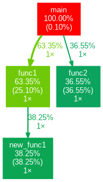
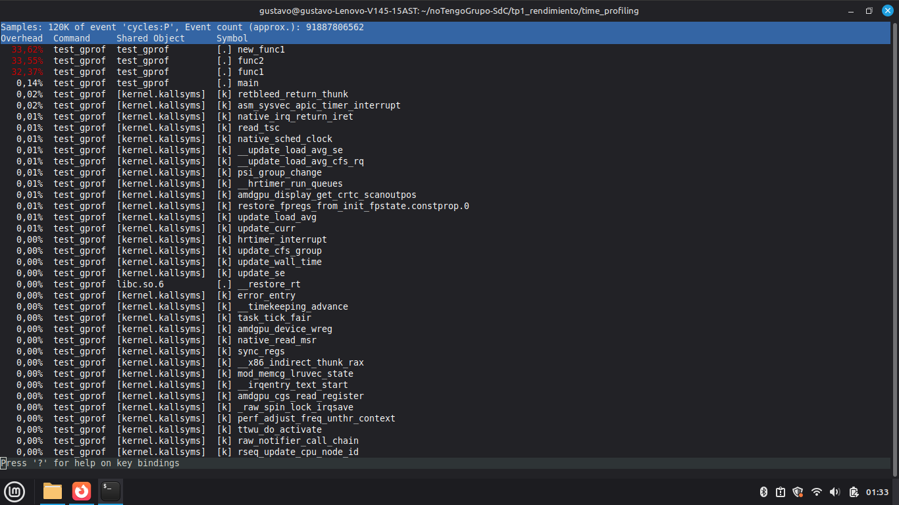

# Sistemas de Computación
## TP1 - Rendimiento
## Integrantes

- 
- 
- Gustavo Regnicoli

## Time Profiling
En primer lugar se realiza el tutorial de gprof y perf, mostrando con capturas de pantalla cada paso y adjuntando conclusiones sobre el uso del tiempo de las funciones.

El profiling es una técnica para medir el rendimiento de un programa,identificando cuánto tiempo consume cada función. Las herramientas utilizadas fueron:

- **gprof**: preciso pero invasivo, requiere recompilar con `-pg`
- **perf**: estadístico y liviano, no requiere recompilar

Se utilizó el programa de ejemplo del tutorial, compuesto por 4 funciones con bucles internos para consumir tiempo de CPU:
```
main()
├── func1()
│   └── new_func1()
└── func2()
```
### Pasos realizados
**1. Compilación con profiling activado:**
```bash
gcc -Wall -pg test_gprof.c test_gprof_new.c -o test_gprof
```

**2. Ejecución del programa**, que genera automáticamente `gmon.out`

**3. Generación del análisis:**
```bash
gprof test_gprof gmon.out > analysis.txt
```

Al procesar el archivo `gmon.out`, se obtuvo el siguiente reporte de tiempos. El programa tardó un total de **30.56 segundos** en ejecutarse:
| % tiempo | Segundos (Self) | Llamadas | Nombre de Función |
| :---: | :---: | :---: | :--- |
| 38.25 | 11.69 | 1 | `new_func1` |
| 36.55 | 11.17 | 1 | `func2` |
| 25.10 | 7.67 | 1 | `func1` |
| 0.10 | 0.03 | - | `main` |

Para una interpretación más clara, se generó un grafo de llamadas utilizando `gprof2dot`:



##  Análisis con Perf (Muestreo Estadístico)
Se ejecutó el comando `sudo perf record ./test_gprof` seguido de `sudo perf report` para validar los datos sin instrumentación:



## Conclusiones Finales
Al examinar los datos obtenidos, se observa que el programa requiere un tiempo total de 30.56 segundos para completar su ejecución, concentrando el 99.9% de la carga de CPU en tres funciones: new_func1, func2 y func1. Individualmente, new_func1 representa el mayor "cuello de botella" con un 38.25% del tiempo de procesamiento. 
El análisis del árbol de llamadas permite identificar que la rama de func1 es el verdadero camino crítico (Hot Path), siendo responsable del 63.4% de la latencia total. En contraste, la función main resulta técnicamente irrelevante en términos de consumo de recursos con apenas un 0.10%, limitándose a actuar como coordinadora del flujo.

En cuanto a la metodología, existe una diferencia clave entre ambas herramientas. Mientras que gprof utiliza la instrumentación para ofrecer una visión exacta de la jerarquía de funciones y el número de llamadas, perf emplea un muestreo estadístico que permite observar el programa en su entorno real.
